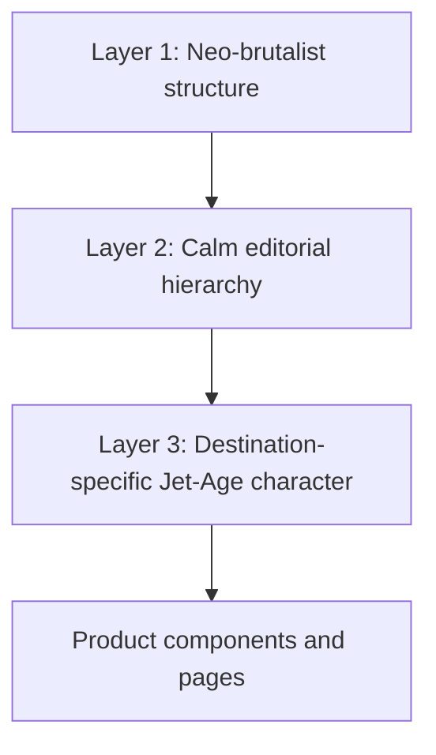

# Japan-first frontend foundation — design and implementation handoff

**Status:** Design direction human-approved; handoff awaiting document review; implementation has not started.

**Date:** 2026-08-09

**Audience:** Gemini or another implementation agent working in this repository.

**Scope:** Refine the existing frontend; do not redesign the product from scratch.

**Golden destination pack:** Japan. Singapore is not the visual reference for this task.
**Cost profile:** USD 0 out of pocket. No paid design services, assets, APIs, hosting, or runtime providers are required.

---

## 1. Read this first

This document turns the human's frontend decisions into an implementation contract. It is intentionally explicit because the next implementer is expected to execute it without inventing a new visual direction.

Before changing code:

1. Read `AGENTS.md`, `DEVIATIONS.md`, the newest report in `reports/`, and `docs/specs/06_implementation_protocol.md`.
2. Read this document completely.
3. Read `docs/specs/10_frontend_build_plan.md` through `15_wit_content_pack.md` for product behavior, data, accessibility, and performance constraints.
4. Inspect the current frontend and run the preflight in section 18.
5. Do not reinterpret settled visual choices. If a detail is genuinely absent, take the most conservative option, log it in `DEVIATIONS.md`, and continue.

### 1.1 Authority and conflict handling

- Backend arithmetic, API contracts, provenance, agent stages, and report semantics remain governed by `docs/specs/00`–`18`. This document cannot change them.
- This document is the approved visual authority for the post-F4 frontend refinement. It supersedes older visual experiments and handoffs where they disagree with it.
- `frontend/design/CONTRACT.md` and visual portions of specs 10/11 are currently stale in places: they still describe Bodoni, soft shell shadows, rounded surfaces, and a Singapore-first celadon/mangrove system. Phase J0 must reconcile `frontend/design/CONTRACT.md` and other editable frontend handoffs in a docs-only commit. Per the repo boundary, `docs/specs/` remains read-only during implementation; this dated, human-approved document records the visual override instead of rewriting specs 10/11.
- Never change a backend golden number, invent a report field, compute money on the frontend, or hide provenance to satisfy a visual design.

### 1.2 The outcome in one sentence

Create a light, calm, ultra-premium travel interface whose structural base is neo-brutalism, whose restrained personality layer is Jet-Age retrofuturism, and whose natural material palette changes by destination—using Japan as the complete reference implementation.

---

## 2. Why the previous attempt was insufficient

The recent work changed fonts and created isolated primitives, but the actual product pages did not absorb a coherent visual system. `OffsetPlate` and `SplitFlap` existed largely as kitchen-sink proofs; the real landing, wizard, loading, itinerary, hotel, payment, transfer, and provenance surfaces still looked like a generic rounded dashboard.

The correction is systemic, not cosmetic:

| Previous problem | Required correction | Why |
|---|---|---|
| Retrofuturism treated as the entire theme | Neo-brutalism remains the base; retrofuturism is a restrained layer | Prevents synthwave, cockpit-dashboard, or generic sci-fi styling |
| Boarding-pass language spread too widely | Ticket/issued-document treatment is limited to flight evidence and genuinely issued artifacts | This product is much larger than flight search |
| Soft rounded cards and blurred shadows | Strong rules, square surfaces, hard offset shadows | Gives the interface physicality and identity |
| Synthetic teal/red accents | Natural destination materials and pigments | The human explicitly rejected artificial and neon-looking color |
| Poiret used too lightly | Poiret One at a visible 3px stroke for large display text | The human found the unstroked/light version barely legible |
| Country identity hardcoded into one Singapore palette | Stable semantic tokens plus destination theme packs | Allows cheaper models to add countries without redesigning components |
| New primitives added without reaching real routes | Prove the system on the actual results, wizard, loading, and landing surfaces | A component is not finished if users never see it |

---

## 3. Frozen human decisions

These are not suggestions. Treat them as design requirements.

1. **Light theme only.** No dark mode is part of this task.
2. **No black anywhere in product UI.** Do not use `black`, `#000`, `#000000`, near-black neutral utilities, or black shadows. Contrast comes from a deep natural pigment supplied by the destination pack.
3. **No neon, holographic, cyberpunk, synthwave, chrome, CRT, laser, nightclub, or artificial high-chroma color language.**
4. **Natural luxury.** Colors should resemble paper, stone, wood, foliage, clay, fiber, leather, and aged metal found in premium physical retail environments.
5. **Neo-brutalism is the structural base.** Thick rules, hard shadows, explicit grids, clear compartments, and tactile controls are foundational.
6. **Retrofuturism is secondary.** It appears through Poiret, Jet-Age route geometry, instrument-like metadata, optimistic motion, and selected circular forms—not through sci-fi decoration.
7. **Calm Route remains the product personality.** The user should see a soothing, clean interface while the complex optimization remains hidden behind it.
8. **Airline Concierge is the selected blend.** Use approximately 75% operational structure and 25% hospitality warmth.
9. **Poiret One remains the display face.** Large Poiret display text uses a 3px outward stroke. Do not fake-bold it.
10. **Schibsted Grotesk remains the interface and numeric face.** All money, points, dense headings, form controls, buttons, and explanatory copy use Schibsted.
11. **Roboto Mono remains metadata-only.** Use it for airport codes, dates, provenance, trace labels, ratios, and compact machine labels.
12. **The palette changes according to destination.** Japan is the reference pack for this task.
13. **Multi-country rule:** the primary destination controls the global page theme. Secondary countries may provide small local accents inside their itinerary/map sections only. The overall page must not recolor while scrolling.
14. **Normal travelers are the audience.** The frontend must not expose internal agent or optimization complexity unless the user asks to inspect reasoning.
15. **Provenance stays visible.** Trust signals are product content, not optional decoration.

---

## 4. Design model: three layers, in order



### 4.1 Layer 1 — neo-brutalist structure

- 2px full-opacity borders using destination `ink`, never black.
- Hard offset shadows with zero blur, normally 6–10px.
- Square principal panels: 0px radius.
- Explicit grid, row, and section boundaries.
- Buttons show a physical pressed state by reducing their offset and scaling to `0.97`.
- Repeating data is organized as ruled rows or ledgers before it becomes a collection of floating cards.
- Pills remain fully rounded only when the semantics are genuinely pill-like: tags, compact filters, status chips, or route nodes.

### 4.2 Layer 2 — calm editorial hierarchy

- Generous page margins and strong whitespace between major scenes.
- No crowded analytics-dashboard layout.
- One dominant idea per viewport.
- Plain-language headings for ordinary travelers.
- Progressive disclosure for assumptions, runner-up reasoning, cap details, and provenance notes.
- Keep the approved current composition wherever possible: editorial header, asymmetric hero, route-first planner, and decision ledger.

### 4.3 Layer 3 — restrained retrofuturism

Allowed:

- Poiret One for large display text.
- Jet-Age airline route diagrams and circular wayfinding nodes.
- Stamped or machine-labelled metadata in Roboto Mono.
- Short route-line drawing and document-issue reveals.
- Space-Age hospitality curves in small doses: circles, capsules, or porthole-like markers.
- Optimistic, precise, physical motion.

Forbidden:

- Dark dashboards, glowing edges, neon gradients, holograms, starfields, scanlines, CRT noise, cockpit control panels, or dense terminal styling.
- Making every container a boarding pass.
- Using split-flap styling for paragraphs, ordinary headings, hotel cards, or itinerary descriptions.
- Decorative airline motifs that make hotels, cards, itinerary curation, or points strategy feel secondary.

---

## 5. Destination theme architecture

### 5.1 Stable semantic contract

Components consume semantic utilities only. A product component must never contain `theme-japan`, a country name, or a country-specific color literal.

The current Tailwind v4 `@theme inline` bridge remains the correct mechanism. Destination packs fill the existing `--th-*` slots. Add a token only when no existing semantic slot can express the required meaning; document and test every addition.

Required slots:

```text
Type:     --th-font-display, --th-font-ui, --th-font-mono,
          --th-display-stroke-hero, --th-display-stroke-mark
Surface:  --th-bg, --th-surface, --th-surface-raised, --th-overlay
Ink:      --th-text, --th-text-muted, --th-text-faint,
          --th-border, --th-on-primary
Action:   --th-primary, --th-primary-hover
Material: --th-accent-1, --th-accent-2, --th-accent-3, --th-accent-4
Meaning:  --th-success, --th-success-text,
          --th-warning, --th-warning-text,
          --th-danger, --th-savings, --th-savings-text
Shape:    --th-radius-s, --th-radius-m, --th-radius-l
Depth:    --th-shadow-1, --th-shadow-2, --th-shadow-3
Optional: --th-pattern-image, --th-pattern-size
```

Do not retain a font-size ratio that can exceed the approved display weight. The current `display-stroked` utility references a ratio and ignores `--th-display-stroke-max`; replace that behavior with named role tokens or a real clamp.

### 5.2 Theme resolution

The theme resolver accepts an ISO country code and returns an allowlisted class.

```ts
type DestinationTheme = "natural" | "japan";

type ThemeResolution = {
  globalTheme: DestinationTheme;
  primaryCountryCode: string | null;
  secondaryCountryCodes: string[];
};
```

Rules:

1. Before a destination is known, render `.theme-natural`.
2. A Japan plan renders `.theme-japan` on the stable route shell.
3. Unknown countries fall back to `.theme-natural`; never guess a palette at runtime.
4. In a multi-country trip, the primary destination owns the global pack.
5. Secondary countries may add local accent variables on a bounded itinerary/map subtree after their own reviewed packs exist.
6. Theme choice must be deterministic and must not depend on an LLM.
7. The server-rendered class and hydrated client class must agree. No theme flash and no hydration mismatch.

### 5.3 Natural fallback

`.theme-natural` is a quiet, country-agnostic material shell. It uses bone, warm paper, walnut ink, stone, olive, and aged bronze. It is a fallback, not another branded destination. It must not visually compete with Japan.

### 5.4 Adding countries later

Cheaper models may add a country by copying `_template.css`, but they may only provide token values, a restrained pattern, licensed imagery, quip content, and snapshots. They must not fork product components or change layout.

Every new pack must document:

- three to five real material references;
- one dominant natural pigment and one supporting pigment;
- a deep non-black accessibility ink;
- a restrained pattern or no pattern;
- imagery rules and license manifest;
- contrast results;
- screenshots at 390, 768, and 1440px;
- a multi-country accent example;
- a short list of cultural clichés explicitly avoided.

---

## 6. Japan reference pack — Quiet Blossom

### 6.1 Art direction

Japan is expressed through rice paper, dusty sakura, hinoki cedar, tea leaf, warm sumi-brown, quiet asymmetry, and seasonal circles. It must feel crafted and contemporary—not like a themed restaurant, anime interface, or tourism poster.

Avoid:

- bright candy pink;
- red-circle flag clichés as the main graphic;
- sakura petals scattered across every surface;
- bamboo/samurai/geisha imagery;
- pseudo-Japanese typography;
- black ink or high-contrast black-and-red styling;
- generic zen minimalism that removes the neo-brutalist character.

### 6.2 Approved palette

The values below were converted from sRGB to OKLCH and checked against the Japan background and surface. Decorative colors are never used as body text.

| Role | Hex | OKLCH | Use |
|---|---:|---:|---|
| Rice-paper background | `#F6F0E8` | `oklch(0.958 0.012 75.4)` | Page canvas |
| Warm paper surface | `#FBF7F0` | `oklch(0.977 0.010 81.8)` | Panels and rows |
| Raised paper | `#FFFDF8` | `oklch(0.994 0.007 88.6)` | Dialogs and raised controls |
| Warm sumi ink | `#51443E` | `oklch(0.398 0.021 46.3)` | Text, 2px borders; 8.26:1 on background |
| Hover ink | `#3F3531` | `oklch(0.338 0.016 43.0)` | Primary hover; 10.51:1 |
| Muted ink | `#6F625C` | `oklch(0.507 0.019 46.4)` | Secondary copy; 5.18:1 |
| Faint ink | `#8C7F78` | `oklch(0.606 0.019 50.3)` | Decorative metadata only; 3.42:1 |
| Sakura dust | `#D8B7B2` | `oklch(0.807 0.039 28.1)` | Selected chips, quiet highlights |
| Washi rose | `#EADBD5` | `oklch(0.902 0.019 43.2)` | Soft bands and pattern field |
| Tea leaf | `#7B806D` | `oklch(0.590 0.029 119.3)` | Secondary natural accent |
| Hinoki shadow | `#9B8978` | `oklch(0.642 0.033 65.6)` | Hard offset plates/shadows |
| Aged brass | `#A48456` | `oklch(0.633 0.074 75.8)` | Decorative savings/value accent |
| Brass text | `#6D5637` | `oklch(0.469 0.055 74.1)` | Savings text; 6.11:1 |
| Success fill | `#6D8068` | `oklch(0.577 0.042 139.2)` | Decorative verified/success surface |
| Success text | `#4B5F48` | `oklch(0.462 0.044 141.4)` | Success label; 6.12:1 |
| Warning fill | `#C09B5A` | `oklch(0.709 0.094 80.4)` | Verify/checkpoint surface |
| Warning text | `#705527` | `oklch(0.468 0.072 78.7)` | Warning label; 6.15:1 |
| Danger | `#8D5C58` | `oklch(0.527 0.065 24.6)` | Error text/rule; 4.88:1 |

Destination surfaces should keep OKLCH chroma at or below `0.04`; decorative accents should stay at or below `0.10`. These ceilings mechanically prevent the artificial/neon drift the human rejected.

### 6.3 Token assignment

```css
.theme-japan {
  --th-font-display: var(--font-poiret-one);
  --th-font-ui: var(--font-schibsted-grotesk);
  --th-font-mono: var(--font-roboto-mono);

  --th-display-stroke-hero: 3px;
  --th-display-stroke-mark: 1.5px;

  --th-radius-s: 0px;
  --th-radius-m: 0px;
  --th-radius-l: 0px;

  --th-bg: oklch(0.958 0.012 75.4);
  --th-surface: oklch(0.977 0.010 81.8);
  --th-surface-raised: oklch(0.994 0.007 88.6);
  --th-overlay: oklch(0.977 0.010 81.8 / 0.88);
  --th-border: oklch(0.398 0.021 46.3);

  --th-text: oklch(0.398 0.021 46.3);
  --th-text-muted: oklch(0.507 0.019 46.4);
  --th-text-faint: oklch(0.606 0.019 50.3);
  --th-on-primary: oklch(0.977 0.010 81.8);

  --th-primary: oklch(0.398 0.021 46.3);
  --th-primary-hover: oklch(0.338 0.016 43.0);
  --th-accent-1: oklch(0.807 0.039 28.1);
  --th-accent-2: oklch(0.902 0.019 43.2);
  --th-accent-3: oklch(0.590 0.029 119.3);
  --th-accent-4: oklch(0.642 0.033 65.6);

  --th-success: oklch(0.577 0.042 139.2);
  --th-success-text: oklch(0.462 0.044 141.4);
  --th-warning: oklch(0.709 0.094 80.4);
  --th-warning-text: oklch(0.468 0.072 78.7);
  --th-danger: oklch(0.527 0.065 24.6);
  --th-savings: oklch(0.633 0.074 75.8);
  --th-savings-text: oklch(0.469 0.055 74.1);

  --th-shadow-1: 6px 6px 0 oklch(0.642 0.033 65.6);
  --th-shadow-2: 8px 8px 0 oklch(0.642 0.033 65.6);
  --th-shadow-3: 10px 10px 0 oklch(0.398 0.021 46.3 / 0.45);
}
```

### 6.4 Pattern and imagery

- Pattern: sparse 20–24px washi grid plus one or two large, low-opacity circular bloom outlines. Never repeat petals as wallpaper.
- Pattern opacity: maximum 8% relative to ink.
- Image materials: early-morning Tokyo streets, restrained sakura detail, hinoki/wood joinery, contemporary Japanese architecture, rail/wayfinding detail, ceramics or paper craft.
- Avoid recognizable faces and brand marks.
- Every committed image requires `public/img/japan/MANIFEST.md` with source URL, creator, license, download date, crop, and usage.
- Use AVIF/WebP at three responsive sizes; do not hotlink an image API.

### 6.5 Japan UI fixture

Japan is a frontend visual fixture, not a backend golden-data rewrite.

- Create a generated-type-valid Japan report fixture under the existing MSW/fixture system.
- Mark invented inventory as `sample`/`estimated` evidence with provenance and `needs_verification` where appropriate.
- Do not modify backend optimizer goldens or the India→Singapore deterministic demo to make the design convenient.
- Every money and points value rendered in the Japan fixture must exist in fixture JSON and pass the no-orphan-numbers test.

---

## 7. Typography contract

### 7.1 Roles

| Role | Family | Allowed contexts | Forbidden contexts |
|---|---|---|---|
| Display | Poiret One 400 with outward stroke | Landing hero, page H1, verdict H1, one major destination title, wordmark | Body, buttons, forms, cards, money, points, dense headings |
| UI | Schibsted Grotesk 400/500/600/700 | H2–H6, body, buttons, forms, functional labels, all money and points | Tiny machine metadata when mono is clearer |
| Metadata | Roboto Mono 400/500 | Airport codes, dates, evidence labels, stages, ratios, trace IDs | Paragraphs, major headings, dominant navigation |

### 7.2 Poiret legibility

- Hero and page-level display text: `-webkit-text-stroke-width: 3px`.
- Wordmark and small approved Poiret marks: `1.5px`; do not use Poiret below 20px.
- Use `paint-order: stroke fill`.
- Never request `font-weight: 600` or `700` on Poiret One.
- Poiret text must remain at least 40px when using the 3px stroke.
- H2 and below use Schibsted; this prevents 3px stroke from filling smaller glyph counters.
- Line height: `0.98–1.05` for Poiret; never below `0.95`.
- Test the actual loaded font, not a fallback. An automated browser test must assert `font-family` contains `Poiret One`.

### 7.3 Numbers

- All money, points, counts, dates, and ratios use tabular numerals.
- Money and points always use Schibsted or Roboto Mono, never Poiret.
- The frontend formats provided minor units but never derives totals, savings, ratios, or conversions.

---

## 8. Shape, border, and depth contract

| Element | Border | Radius | Shadow | Notes |
|---|---|---:|---|---|
| Page/section panel | 2px ink | 0 | 8px hard hinoki | Default neo-brutalist surface |
| Repeating ledger row | 1–2px separator | 0 | none | Prefer rows over floating cards |
| Primary button | 2px ink | 0 | 4px hard ink/hinoki | Press reduces offset and scales to 0.97 |
| Text/select input | 2px ink | 0 | none | Strong focus ring outside border |
| Tag/filter chip | 1.5–2px ink | full or 0 | 2px when selected | Full radius only if it behaves as a chip |
| Status/provenance chip | 1px ink | full | none | Always includes text/icon, never color alone |
| Route node | 2px ink | circle | none | Retrofuturist wayfinding role |
| Dialog/sheet | 2px ink | 0 | 10px hard ink at controlled opacity | No blurred glass card |
| Flight evidence / issued artifact | 2px ink | 0 | offset plate | Ticket language allowed here |
| Hotel/itinerary/payment card | 2px ink | 0 | hard material plate where emphasis needs it | Must not look like a boarding pass |

Do not apply `.register-issue` only when a surface contains a computed number. That rule made almost the whole results page an issued document. Replace it with semantic component variants: `surface`, `ledger`, `evidence`, and `issued`.

---

## 9. Component visual grammar

Every component must support default, hover, focus-visible, active, disabled, loading, empty, error, and reduced-motion states when applicable.

### 9.1 shadcn relationship

shadcn/Radix provides accessible behavior and state handling. It does not provide the finished appearance.

- Reuse shadcn primitives when they fit.
- Query the official shadcn MCP before adding or reimplementing a registry component.
- Review registry code line by line before commit.
- Rewire every registry component to semantic tokens in the same commit.
- Do not ship default neutral colors, rounded-card styling, generic shadows, or invented props.
- Magic UI and Aceternity are optional, not goals. Keep a component only if it adds a required interaction without WebGL, hardcoded color, unsafe code, or performance regression.

### 9.2 Product primitives

| Primitive | Required treatment |
|---|---|
| `SiteHeader` | Quiet horizontal shell, Poiret/Schibsted wordmark, ruled bottom edge, no floating glass nav |
| `WizardShell` | One large workbench surface; explicit five-step rail; never five unrelated cards |
| `StageTracker` | Real seven-stage data only; route-like line with nodes; current stage has a restrained pulse |
| `VerdictHeader` | Editorial verdict plus one strong value ledger; no generic KPI-card trio |
| `ItineraryTimeline` | Day chapters and ruled POI rows; route spine is retro layer, not the container shape |
| `TripMap` | Japan-tinted low-saturation map, numbered day markers, static fallback |
| `PaymentStrategyCard` | The star analytical surface; recommended card, applied offers, fees, and runner-up reasoning remain readable |
| `TransferPlanPanel` | Verify-first checkpoint dominates; transfer steps remain visually locked until checked |
| `TrustChip` | Sole provenance chip pattern; meaning conveyed by text/icon plus token pair |
| `OffsetPlate` | Hard, zero-blur, destination material shadow; no direct `--th-*` use in TSX |
| `SplitFlap` | Reserved for a brief selected value/route moment; not the default money renderer |
| `MoneyText` | Schibsted, tabular, render-only; never computes |
| `WhyThis` | Progressive disclosure with plain-language summary and exact evidence atoms |

---

## 10. Page specifications

### 10.1 Implementation order

Design and validate the **results page first**. It contains nearly every difficult primitive and prevents the foundation from becoming a marketing-only theme. Then propagate the approved system to wizard, loading, and landing without changing their product structure.

### 10.2 Results — golden screen

Use a type-valid Japan fixture and preserve the order required by spec 13:

1. **Verdict header** — one plain-language recommendation, trip duration/destination, gross/effective/savings ledger, confidence and freshness.
2. **Flight evidence** — cash, award, observed, and sample evidence remain visibly distinct. This is one of the few places ticket/issued-document styling is allowed.
3. **Stay intelligence** — image, area, route fit, cancellation/rate assumptions, price evidence, and verification status. It must look like a premium hotel comparison, not a flight ticket.
4. **Itinerary timeline** — days, neighborhoods, POIs, durations, prices, and fallback state.
5. **Map** — lazy, Japan-tinted, day-number markers, hotel area, flight route, static fallback.
6. **Payment strategy** — line assignments, recommended card, channel, offers, benefits, fees, runner-up delta, and optimizer explanation atoms.
7. **Points and transfers** — REDEEM/PAY_CASH/NO_DATA variants; verify-first remains step one.
8. **Booking checklist** — in-memory only.
9. **Assumptions and provenance** — sources, minimum verified date, warnings, disclaimer, start-over action.

No section may disappear because it is visually inconvenient. Empty/partial states must use honest copy.

### 10.3 Wizard

- Preserve the five-step order and validation contract.
- Use one neo-brutalist planning workbench with a route/rail progression.
- Limit each step to 3–5 inputs.
- Capsule forms are allowed only for tag/chip selections; ordinary fields stay square.
- Cards remain abstract and text-labelled; no bank logos.
- Step changes move focus to the heading and announce through `aria-live`.
- Back preserves state; Next is disabled until valid.
- `needs_clarification` reopens the dedicated review variant.

### 10.4 Loading

- Destination art is a quiet Japan strip, not a full-screen tourism image.
- Stage tracker binds only to real backend stages.
- Quips crossfade every six seconds and remain decorative (`aria-live=off`).
- Results skeleton is dimensionally identical to the completed layout.
- No fake percentages, countdowns, or agent thought traces.

### 10.5 Landing

Refine the current Calm Route composition; do not replace it with a new marketing template.

- Keep the editorial header, asymmetric two-column opening, journey-draft planner, route-first language, and decision ledger.
- Replace generic rounded/soft styling with the Japan neo-brutalist material system.
- Use one Japan image/art moment, not a collage.
- The headline explains the consumer benefit, not the agent architecture.
- Primary CTA enters the wizard; trust copy explains no bank/loyalty credentials and visible provenance.
- No results values are invented for visual effect; use fixture-backed proof only.

### 10.6 Wallet, offers, and future account surfaces

These are not implemented by this task unless already present in the kitchen sink. The foundation must nevertheless support them:

- card balances as ruled wallet tiles;
- offer windows and acquisition guidance as report-only evidence;
- no logos, PANs, login prompts, or fake issuer art;
- destination pack affects the page material system, not the identity of bank cards.

---

## 11. Motion and interaction

Motion is rare, purposeful, and physical.

| Interaction | Duration | Treatment | Reduced motion |
|---|---:|---|---|
| Button press | 100–140ms | scale to 0.97; hard shadow offset compresses | Keep immediate feedback |
| Hover/focus color | 140–180ms | token shift only | Keep |
| Select/popover | 125–180ms | opacity + 4px translate | Opacity only |
| Wizard step | 180ms | short directional slide + fade | Fade only |
| Accordion | 180–220ms | measured height + opacity | Instant/opacity |
| Route line draw | 450–650ms once | SVG stroke reveal | Fully drawn |
| Results issue/reveal | 450–650ms once | hard plate settles; sections reveal in order | Immediate content |
| Loading quip | 200ms | crossfade every 6s | Static replacement |

Rules:

- Animate transform and opacity only in frequent UI.
- No bouncing, floating, cursor-following, perpetual parallax, or decorative loops.
- Remove or heavily gate confetti. It conflicts with the premium natural direction; no confetti is the default for this task.
- `PageTransition` must render visible server markup. Never ship SSR with the whole page at `opacity: 0` while waiting for hydration.
- Under reduced motion, every required element must compute to visible opacity and stable position.

---

## 12. Responsive behavior

Required proof viewports: 390px, 768px, and 1440px.

### 12.1 Desktop — 1440px

- Page shell max width: `1240px`, centered.
- Page shell horizontal padding: `30px`; the resulting maximum content width is `1180px`.
- Use the existing `53/47` split for the landing opening. Use `60/40` only for a results row whose primary decision surface needs visibly more room; do not invent another split.
- Major section block spacing: `64px`; related content spacing inside a section: `24px` or `32px`.
- Page top/bottom padding: `56px`.
- Default panel shadow: `8px`; reserve `10px` for dialogs and the single dominant results surface.

### 12.2 Tablet — 768px

- Collapse large two-column stories to one column unless comparison genuinely needs two.
- Preserve ruled groupings and hierarchy; do not merely shrink desktop.
- Page shell horizontal padding: `28px`; major section spacing: `48px`.
- Hard shadows reduce to `6px`.
- Tables/ledgers may become labelled stacked rows.

### 12.3 Mobile — 390px

- Page shell horizontal padding: `20px`; major section spacing: `40px`.
- Single-column reading order follows product priority.
- Hard shadows reduce to `4px`.
- No horizontal scrolling except intentionally labelled comparison rails.
- Buttons meet 44px minimum target size.
- Tags wrap; money values never break digit-by-digit.
- Sticky controls must not cover disclaimers, verification, or keyboard-focused fields.

---

## 13. Accessibility and trust

1. WCAG AA: body text 4.5:1; large text and focus indicators 3:1.
2. Faint ink is decorative only and cannot be the sole rendering of required information.
3. Focus-visible rings use a tested 3:1 contrast against every effective background.
4. No color-only status. Pair color with icon and text.
5. Keyboard support is mandatory for wizard steps, tags, cards, tabs, disclosures, verification checkbox, checklist, dialogs, and map fallback controls.
6. Maintain logical heading order and landmark structure.
7. On wizard step change, focus the step heading and announce `Step N of 5, {name}`.
8. Loading quips remain silent to screen readers; actual stage changes may announce politely.
9. Provenance and `needs_verification` cannot be hidden in tooltips only.
10. Japanese destination theming does not imply Japanese-language copy. If localization is added later, verify longer/shorter string behavior separately.

---

## 14. Content, edge cases, and states

### 14.1 Required states

Every product surface must demonstrate:

- complete/happy;
- loading;
- empty;
- partial/fallback;
- warning/stale;
- error;
- disabled;
- focus-visible;
- reduced-motion.

### 14.2 Content limits

- Card title: two lines, then ellipsis with full value available accessibly.
- Metadata label: one line where possible; wrap by words, never by characters.
- POI/hotel description: 2–3 lines in lists; full content in detail/disclosure.
- Provenance source label: may wrap; source URL itself should not dominate the card.
- Trace ID: mono, selectable, never truncated without a copy affordance.
- Money: no abbreviation unless the backend-provided display contract explicitly allows it.

### 14.3 Failure behavior

- Missing image: material placeholder with text label; no broken icon.
- No live quote: explicitly say sample/observed/estimated according to evidence type.
- No transfer advice: show the documented unlock/no-data line.
- Fallback itinerary: show the fallback badge at section level.
- Network/pipeline failure: preserve `trace_id`, retry action, and user's intake state.
- Theme pack missing: fall back to `theme-natural`; never render unstyled or black.

---

## 15. Tool and skill protocol

Tools support judgment; they do not replace this specification.

### 15.1 Required skills

At minimum, the implementing agent should invoke the available equivalents of:

- `superpowers:using-superpowers`;
- `superpowers:writing-plans` after the human approves this design document;
- `superpowers:test-driven-development`;
- `superpowers:verification-before-completion`;
- `superpowers:requesting-code-review`;
- `frontend-design:frontend-design`;
- `emil-design-eng`;
- `design:accessibility-review`;
- `review-animations` for motion-heavy changes.

Use systematic debugging only after a failure is reproduced. Do not use a design skill to override frozen product behavior.

### 15.2 shadcn MCP

- `components.json` lives in `frontend/`, not the repository root. A root-scoped shadcn MCP check may incorrectly report no registries.
- Start the shadcn tool in the `frontend` working directory or configure its project root accordingly.
- The project uses Radix Nova and currently declares Aceternity and Magic UI registries.
- Query registry items and examples before adding anything.
- Do not install a component merely because it looks impressive.
- Run the shadcn audit checklist after all registry additions.

### 15.3 Framer

- Existing project: **Courteous Jargon**.
- It already includes Poiret One, Schibsted Grotesk, and Roboto Mono.
- It currently has one 1440px desktop page with a header, four sections, and a body note. It is a design sandbox, not production source of truth.
- Use it to validate the Japan golden results composition and motion ideas.
- Add tablet/mobile proofs only after desktop structure is approved.
- Do not publish the Framer site.
- Preserve any manual edits and review screenshots after each major canvas change.

### 15.4 Figma MCP

- Use Figma for the final token matrix, component anatomy, states, and developer handoff—not as another disconnected visual experiment.
- Load the required Figma MCP skill before calling write tools.
- Search the available design system before creating new components.
- Batch reads/writes because plan limits may be low.
- One file/page structure is enough: Foundations, Components, Japan Golden Results, Responsive Proofs.
- Code remains the runtime source of truth; Figma documents decisions.
- Do not make Figma availability a phase gate. The repository specification and tests must be sufficient on their own.

### 15.5 Browser, Playwright, and DevTools

- Use Playwright for screenshots and interaction proofs at 390/768/1440.
- Use Next.js DevTools after client/server boundary, font, provider, and animation changes.
- Use Chrome DevTools for LCP, CLS, INP, bundle, and animation performance at the final gate.
- Read console errors after each representative page, not only at the end.

---

## 16. Recommended implementation phases

This is the required ordering. A later implementation plan may decompose these into smaller tasks, but it must not reorder them without a logged deviation.

### J0 — Restore the frontend gate and reconcile docs

- Fix the known preflight failures without visual refactoring:
  - `RegisterSpecimenView.tsx` fixture missing `AppliedOffer.stacking_class`;
  - direct `--th-*` usage in `OffsetPlate` and `SplitFlap`;
  - `globals.css` manifest lint;
  - missing `--th-display-stroke-ratio` bridge/contrast manifest entry.
- Reproduce and fix the page-transition SSR invisibility if still present.
- Update stale editable frontend documentation to point to this approved direction. Do not edit `docs/specs/` during implementation.
- Gate must be green before theme work.

### J1 — Theme contract and Japan pack

- Add `theme-natural` and `theme-japan`.
- Make destination resolution deterministic and hydration-safe.
- Replace soft-shell radius/shadow defaults with the neo-brutalist semantic contract.
- Implement named Poiret stroke roles and the no-black/high-chroma safeguards.
- Add contrast/token tests and a Japan theme-proof route.

### J2 — Product primitive migration

- Migrate shadcn primitives and shared product components to the new semantic geometry.
- Replace boolean `.register-issue` styling with semantic surface variants.
- Keep ticket styling limited to flight evidence/issued artifacts.
- Complete kitchen-sink states before page work.

### J3 — Japan golden results

- Add the type-valid Japan frontend fixture.
- Build and verify the complete results story first.
- Exercise happy, fallback, stale, REDEEM, PAY_CASH, NO_DATA, failure, and reduced-motion states.
- Create the Framer/Figma reference only from the approved system.

### J4 — Wizard, loading, and landing propagation

- Apply the system to the existing structures without redesigning flows.
- Preserve form/accessibility contracts and real-stage loading.
- Remove generic-dashboard residue and unused/dormant visual primitives.

### J5 — Responsive, accessibility, performance, and handoff

- Capture screenshots at all required viewports.
- Run accessibility, contrast, token, type, unit, component, and e2e gates.
- Run performance trace; remove optional libraries/components that miss budgets.
- Finalize Figma handoff if available.
- Update frontend report and documentation.

---

## 17. Commit discipline

1. J0 repairs are separate from visual behavior changes.
2. Theme tokens and destination resolver land before component migrations.
3. Component refactors and visual behavior changes are separate where feasible.
4. Never mix backend/API changes into this task.
5. Registry component acquisition and semantic-token rewiring happen in the same commit.
6. Generated code, fixtures, snapshots, and UI consuming them land together when a generated contract changes. This task should not require an OpenAPI change.
7. Keep the gate green between commits.

---

## 18. Verification gates

### 18.1 J0 preflight

Run from `frontend/`:

```bash
npx tsc --noEmit
node scripts/token-lint.mjs
npx vitest run tests/contrast.test.ts tests/contract.test.ts
```

Known preflight baseline on 2026-08-09: typecheck, token lint, and contrast currently fail. Do not claim J0 complete until all are green.

### 18.2 Standard frontend gate

Use the repository's existing package scripts where available. At minimum:

```bash
npx tsc --noEmit
npx eslint .
node scripts/token-lint.mjs
npx vitest run
npx playwright test
npm run build
```

### 18.3 New design-specific assertions

Add automated checks for:

- no pure-black literals or `black` Tailwind utilities in product/theme files;
- destination surface chroma `<= 0.04` and decorative accent chroma `<= 0.10`;
- all Japan text/background pairs meet their required contrast;
- every product component consumes semantic utilities rather than direct `--th-*` variables;
- main panels compute 0 radius, 2px borders, and zero-blur offset shadows;
- hero/H1 loads Poiret One and computes a 3px stroke;
- money/points never compute in components and never use Poiret;
- server-rendered page content is visible before animation hydration;
- reduced-motion leaves all required content visible;
- theme resolver returns Japan only for allowlisted Japan codes and natural fallback otherwise;
- primary destination controls global multi-country theme;
- flight evidence type labels cannot be visually collapsed into one generic price;
- provenance chips render for verified and needs-verification fixtures;
- every displayed number originates in fixture/report JSON.

### 18.4 Visual review matrix

Capture and review:

| Route/surface | 390 | 768 | 1440 | Reduced motion | Keyboard |
|---|---:|---:|---:|---:|---:|
| Landing | required | required | required | required | required |
| Wizard each step | required | representative | required | required | required |
| Loading | required | representative | required | required | n/a |
| Results happy | required | required | required | required | required |
| Results fallback/stale | required | representative | required | required | required |
| Transfer variants | required | representative | required | required | required |
| Theme proof Japan/natural | required | required | required | n/a | n/a |

### 18.5 Performance budgets

Keep existing spec-13 budgets:

- LCP `<= 2.5s` on landing and results;
- CLS `<= 0.1`;
- INP `<= 200ms`;
- no GSAP, Lenis, MapLibre, or optional cinematic library in initial landing JS;
- no WebGL/shader dependency introduced for styling;
- transform/opacity-only frequent animation.

---

## 19. Files likely to change during implementation

This is orientation, not permission to rewrite everything.

```text
frontend/src/app/layout.tsx
frontend/src/app/page.tsx
frontend/src/app/plan/page.tsx
frontend/src/app/globals.css
frontend/src/themes/base.css
frontend/src/themes/registers.css
frontend/src/themes/_template.css
frontend/src/themes/natural.css                 (new)
frontend/src/themes/japan.css                   (new)
frontend/src/components/product/*
frontend/src/components/ui/*                    (only where semantic styling needs it)
frontend/src/mocks/*                            (Japan fixture)
frontend/tests/*
frontend/e2e/*
frontend/design/CONTRACT.md
frontend/design/contracts/*
frontend/design/refs/japan/*                    (licensed/reference artifacts)
```

Do not change `backend/core/`, backend goldens, OpenAPI contracts, provider adapters, or MCP runtime configuration for this visual task.

---

## 20. Gemini anti-drift checklist

Before every task, ask:

- Am I preserving the existing page/flow rather than inventing a new product?
- Is neo-brutalism still the structural base?
- Is retrofuturism a restrained layer rather than the whole interface?
- Is every color natural, destination-derived, low-chroma, and non-black?
- Am I implementing Japan, not silently reverting to Singapore?
- Is Poiret restricted to large display roles with the approved stroke?
- Are money and provenance still exact and visible?
- Did I use shadcn for behavior without shipping its default appearance?
- Did I verify the actual route, not only a kitchen-sink component?
- Did I run the gate and inspect screenshots before claiming completion?

Stop and correct the work if any answer is no.

---

## 21. Definition of done

This task is complete only when all of the following are true:

1. The existing frontend gate is green.
2. Japan is implemented as the complete golden destination pack and natural is the safe fallback.
3. No product UI uses black or synthetic/neon styling.
4. Neo-brutalist geometry is visible across actual landing, wizard, loading, and results routes.
5. Retrofuturist styling is restrained and does not turn the product into a flight-ticket theme.
6. Poiret is legible with the approved stroke and never used for money or dense UI.
7. All results surfaces, transfer variants, evidence meanings, provenance, empty/error states, and reduced motion are represented.
8. Screenshots pass at 390, 768, and 1440px.
9. Accessibility and performance budgets pass.
10. Framer/Figma artifacts, if used, match the implementation and are not required to understand it.
11. Documentation, deviations, tests, fixtures, and implementation agree.
12. A later model can add a new country by filling the pack template and assets without changing product components.

---

## 22. Explicit non-goals

- Implementing Singapore or every destination pack.
- Changing backend itinerary, optimizer, transfer, card, or evidence behavior.
- Connecting Tripadvisor, travel-provider MCPs, or live APIs.
- Rewriting the frontend from scratch.
- Adding dark mode.
- Public deployment or publishing Framer/Figma artifacts.
- Paid assets, services, or overage-capable free tiers.
- Booking or transfer execution.
- Bank/loyalty login collection.
- Adding cinematic effects merely because a registry contains them.

---

## 23. Final instruction to the implementation agent

After the human approves this document, write the detailed implementation plan before editing product code. Do not begin with a broad visual rewrite. Begin with J0, prove the gate is green, implement the Japan token contract, and migrate one representative component at a time with tests. The golden results page is the design proof. Once it passes, propagate the same system to the existing wizard, loading, and landing structures. If the implementation looks impressive in a component catalog but generic on the actual results route, the task is not done.
